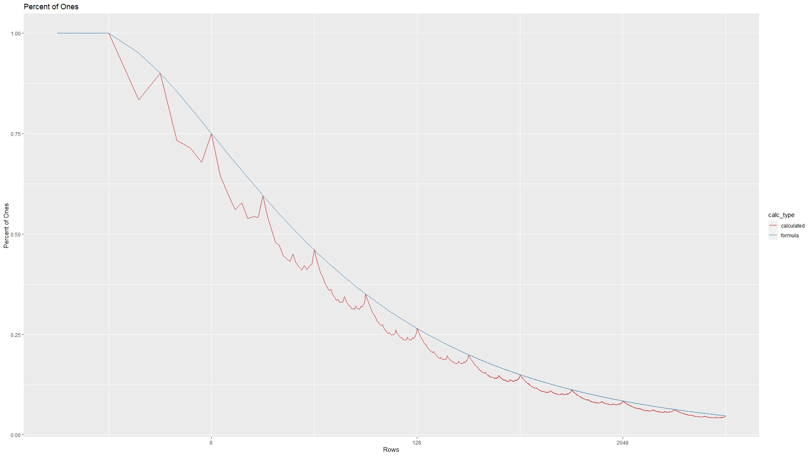

# Solution to MPMP: How odd is Pascal's Triangle

The question to answer is: what percentage of the numbers in the first 128 rows of Pascal's Triangle are odd? Here the top row is numbered 1.

## Initial Solution

I started the problem by creating a spreadsheet in Google Docs. You can find the link here. [Link to Google Sheets](https://docs.google.com/spreadsheets/d/1bbRUIG43q1GLCA5BhBqXe2sUSBq06t17sz1r_4MIY9c/edit?usp=sharing).

While completing the spreadsheet, I remembered that Pascal's Triangle forms a sort of [Sierpenski's Triangle](https://en.wikipedia.org/wiki/Sierpi%C5%84ski_triangle) when you look at the numbers modulo 2. That give a big hint on how to solve the problem algebraically.

## Algebraic Solution

Since I am having trouble formatting mathematics correclty on this page, I will link to the algebraic solution in PDF format. [Link here](Algebraic-Solution.pdf)

## Comparing the Algebraic Solution to Actual Results
To compare the algebraic solution, valid only for powers of 2, to the solution for all rows, I created a R script. [Link here](pascal_triangle_test.R) The script produced the graph below. The function starts to match the real percentage well for large numbers of rows.

