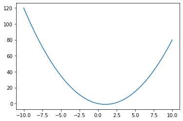
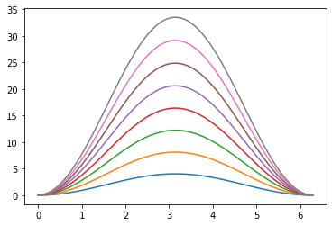

# Sanity Check
Will optimization work with global variables?


```python
from scipy.optimize import minimize_scalar
import math
```


```python
a = 1
b = -2
c = 0
def f(x):
    return a*x**2 + b*x + c
```


```python
import matplotlib.pyplot as plt
import numpy as np
x_range = np.linspace(-10, 10, 100)
fig = plt.figure()
plt.plot(x_range, f(x_range))
```


    [<matplotlib.lines.Line2D at 0x1624743ba30>]


    

    


```python
res = minimize_scalar(f)
print(res)
```

         fun: -1.0
        nfev: 8
         nit: 4
     success: True
           x: 1.0
    

Looks like it will work!!!

# Real Work


```python
from scipy.optimize import minimize_scalar
import math
n = 2
x_i = [0] # x contains the x_i variables

def E(x):
    sum = 0
    for m in range(1, n):
        sum += 1.0 + math.exp(0.02 * (n-m)) - 2 * math.exp(0.01 * (n - m)) * math.cos(x - x_i[m-1])
        
    return sum
# end def E

for n in range(2, 10):
    x_range = np.linspace(0, 2 * np.pi, 100)
    y_range = []
    for x in x_range:
        y_range.append(E(x))
    
    plt.plot(x_range, y_range)

    x_i.append(minimize_scalar(E).x)
    
print(x_i)
```

    [0, -3.652965671110799e-11, -4.299120115163792e-11, -5.115465673023979e-11, -6.17184685701284e-11, -3.14337496803989e-11, -1.0061751819091012e-11, -6.265725760327297e-11, -3.028723328569265e-11]
    


    

    


```python

```
