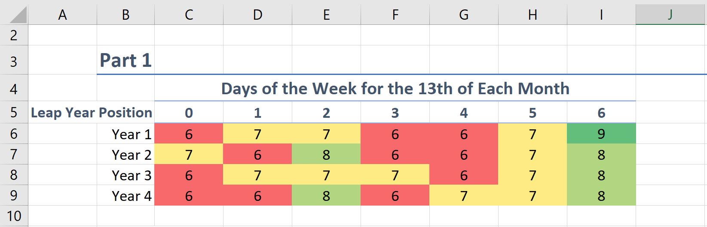
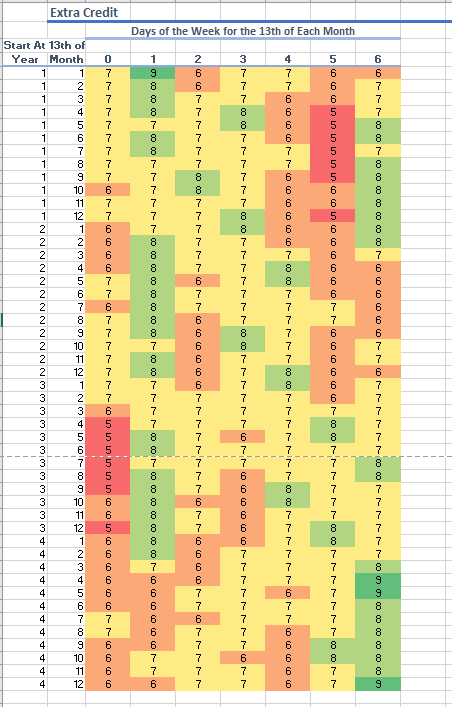

# Riddler Express Solution - November 20, 2020

## Problem Statement

The full text of this week's Riddler Express can be found at [this link](https://fivethirtyeight.com/features/can-you-pass-the-cranberry-sauce/).

>Depending on the year, there can be one, two or three Friday the 13ths. Last week happened to be the second Friday the 13th of 2020.
>
>What is the greatest number of Friday the 13ths that can occur over the course of four consecutive calendar years?
>
>Extra credit: What’s the greatest number of Friday the 13ths that can occur over a four-year period (i.e., a period that doesn’t necessarily begin on January 1)?

## Solving the Problem
To solve the problem, I used Microsoft Excel. An HTML version is [here](Riddler_Express.htm). The workbook can be found [here](Riddler_Express.xlsx).

For the first part, I started by counting days after January 1st of the first year. I had to go through this count four times, as any one of the four years could be a leap year. To save space, I just counted the 13th of each month. This required to track the number of days in each month, including leap years. I used a formula similar to the following:
`=C2+IF(B3=1,OFFSET($P$3,MOD($A2-1,12),0),OFFSET($O$3,MOD($A2-1,12),0))`.
The cell `B3` tracked if that year was a leap year.

For each count, I converted the day numbers to modulo 7 to see which day of the week the 13th or each month fell. Finally, I counted the occurances of each equivalence class in each four-year period. I counted using the `countif` function similar to the following: `=COUNTIF(Part_1!$D$2:$D$49,C$5)`.

The highest number of similar days of the week was day 6 when the first year is a leap year. Day 6 is a Friday if the first of the year is Sunday.

## Extra Credit
For the Extra Credit, I created an eight-year count of days, starting with January 13th starting at 1 and the first year as a leap year. I then started counting days of the week as in Part 1. I started each count at the 13th of the month, as the four-year period with the most Friday the 13ths should start on the 13th. I used the `offset` function to keep track of the range of days to count: `=COUNTIF(OFFSET(Part_2!$D$2,12*($A15-1)+($B15-1),0,48,1),C$14)`.

Just like in Part 1, the maximum number of similar days of the week for the 13th in a four-year period is 9.

## Skipping Leap Years
I checked if skipping a leap year affects the number of Friday the 13ths. The calendar skips leap years in the first year of each century, except when the century is divisible by 400. Looking at four non-leap years in a row gives a maximum of 8 Friday the 13ths.

## Web App?
I started to build a web app to solve the problem. I got Part 1 correct, but it looks like I messed up on the Extra Credit. I gave up after a while, as I have pleanty of class work to finish for the end of the semester.
[Link to app](calendar.html).

