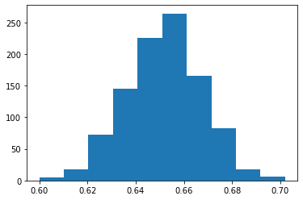

# Riddler Express - 2021-08-13

## Function to run one trial


```python
import random
def trial():
    you = random.uniform(0.9, 1.0)
    cleverest = True
    for i in range(0, 9):
        if(you < random.uniform(0.0, 1.0)):
            cleverest = False
            
    return cleverest
# end trial()
```

## Function to run mutiple trials as a simulation


```python
maxTrials = 1000
def simulation():
    successes = 0
    for i in range(0, maxTrials):
        if(trial()):
            successes += 1
    return successes / maxTrials

print(simulation())
```

    0.622
    

## Run multiple simulations and collect the results


```python
data = []
for i in range(1000):
    data.append(simulation())
```

## Print the mean of the simulations.
This is our reasonable estimate of the answer.


```python
import numpy as np

np.mean(data)
```


    0.651563


## Display the distribution of the simulation results
Should be familiar to anyone who has seen the Central Limit Theorem from statistics.


```python
import matplotlib.pyplot as plt
plt.hist(data)
```


    (array([  5.,  18.,  72., 145., 226., 264., 165.,  82.,  17.,   6.]),
     array([0.6   , 0.6102, 0.6204, 0.6306, 0.6408, 0.651 , 0.6612, 0.6714,
            0.6816, 0.6918, 0.702 ]),
     <BarContainer object of 10 artists>)


    

    

