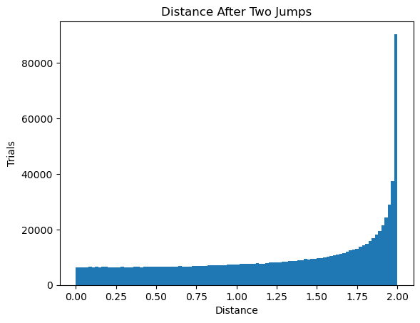

# Cricket Jump Simulation
  
For this problem, we a trying to catch a cricket.
  
[Link to problem:](https://fivethirtyeight.com/features/can-you-catch-the-cricket/)
   
> Help, there’s a cricket on my floor! I want to trap it with a cup so that I can safely move it outside. But every time I get close, it hops exactly 1 foot in a random direction.

>I take note of its starting position and come closer. Boom — it hops in a random direction. I get close again. Boom — it takes another hop in a random direction, independent of the direction of the first hop.

>What is the most probable distance between the cricket’s current position after two random jumps and its starting position? (Note: This puzzle is not asking for the expected distance, but rather the most probable distance. In other words, if you consider the probability distribution over all possible distances, where is the peak of this distribution?)

## This is the function for running one simulation.


```python
import random
import math
def trial():
    angle1 = random.uniform(0.0, 2 * math.pi)
    angle2 = random.uniform(0.0, 2 * math.pi)
    x = math.cos(angle1) + math.cos(angle2)
    y = math.sin(angle1) + math.sin(angle2)
    return math.sqrt(x**2 + y**2)
```

## Now, run multiple simulations.


```python
maxTrials = 1000000
data = []
for i in range(maxTrials):
    data.append(trial())
```

## Display a histogram of the results


```python
import matplotlib.pyplot as plt
plt.hist(data, bins=100)
plt.title("Distance After Two Jumps")
plt.xlabel("Distance")
plt.ylabel("Trials")
plt.show()
```


    

    


It looks like 2 feet is the most probable distance.
