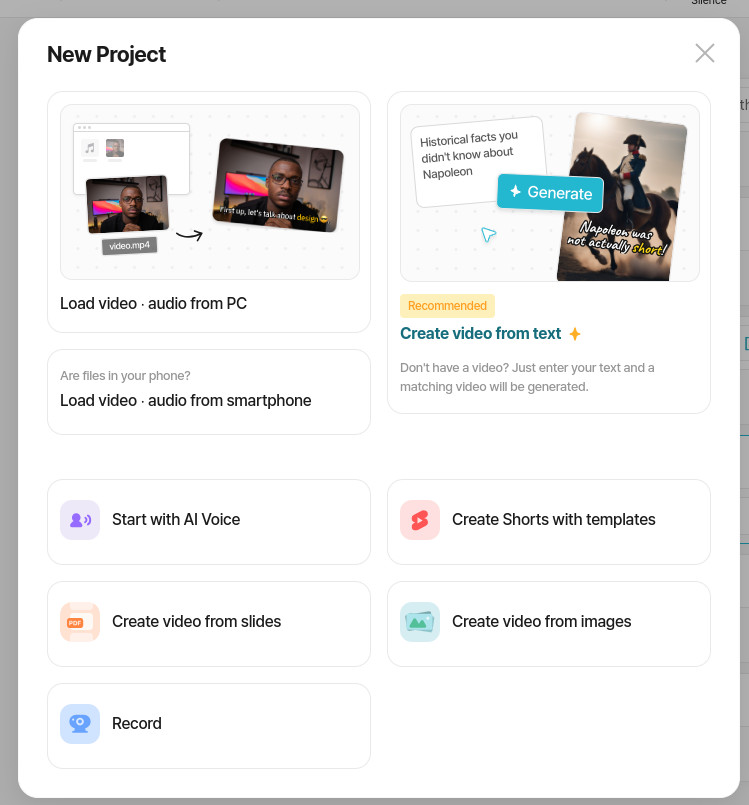

# Review of Vrew - An AI Video Editing Tool

## Summary

Vrew is an easy to use video editor with the ability to transcribe speech to text and add captions to a video.
This feature makes it a worthwhile tool for educators creating videos for teaching. 
The video editing features are at a bare minimum, but that is a positive for educators.
There are generative AI features built into Vrew, but those are not useful for my needs.

**Disclosure** VoyagerX, the creators of Vrew asked me to write this reveiew.
I have not been compensated for the review.

## Using Vrew

For this review, I decided to make an updated introduction video for my Liberal Arts Mathematics course. I wrote the script, recoreded the video, and saved both to my desktop.

The first step is opening a new project.
  
There are several options when creating a new project.
I used "Load video-audio from PC".
Many of the other options are useful for creating videos with generative AI features.
I experimented with "Create video from slides" last year.
The results were passible, but I've decided to stick to my own voice for now on.
(I am not a fan of AI created videos.
Their proliferation on YouTube is one of the reasons I left the platform.)

In addition to selecting a video file, it is possible to open a text file containing the script.
  
This is a handy feature because it limits the transcription errors.
Since I use a teleprompter, I have the script ready to load.
(I am terrible on camera without a script and teleprompter.)

After loading the files, Vrew starts transcribing the speech in the video.
  
Vrew offers two speech-to-text engines as options, Google's engine and the [Whisper](https://openai.com/index/whisper) engine.
I prefer Whisper simply because I am trying to de-Google as much as possible.

The captioning results are pretty accurate.
Using a teleprompter helps me annunciate clearly, allowing for clean transcriptions.
I find that math terminology can confuse the AI transcription engine.
Fortunately, Vrew makes correcting the captions easy.

The best feature of Vrew is the ability to edit a video by deleting the transcribed text.
  
Silences, pauses, and breaths are easy to identify and eliminate using the Backspace key.
This feature should not be used heavily for direct-to-camera videos.
For voiceover videos, this is a great for cleaning your presentations.

The second best feature of Vrew is the ability to correct captions.
This is the feature I use the most, as math terminology is a struggle for the AI transcription engine.
  
During my recording session, I misread one line of the teleprompter.
Fortunately, I can simply retype the caption to the line I recoreded.
  

Once the captions are ready, you can finish by exporting the video and caption file.
There are several options for exporting a video.
  
For my purposes, having the option to export a high-quality or low-quality is important.
I have one teaching situation where storage space is limited, so low-quality videos are a necessity.

(The "Improved Export" option did not work for me.
I had to export the video a second time with that option turned off.)

I sometimes export the video with the captions "burned into" the video file.
  
However, in most situations, I will turn off the captions from the video and export them in a separate subrip file.
The subrip file can be uploaded to YouTube and Peertube.
  

The final step of the process is uploading the exported video to Peertube.

Here is the finished result.
<iframe title="Liberal Arts Mathematics - Course Introduction" width="560" height="315" src="https://spectra.video/videos/embed/2f1925b7-e375-43e4-96b3-fa125cb9e233" frameborder="0" allowfullscreen="" sandbox="allow-same-origin allow-scripts allow-popups allow-forms"></iframe>

The process of correcting captions can get tedious when it misaligns the captions with the video.
Sometimes Vrew attempts to fit a large amount of video into a single word and it takes quite a lot of typing to get everything realigned.

## Vrew on Linux

Vrew is available on Linux.
It is distributed as a [AppImage](https://appimage.org).
That means running Vrew is a simple as downloading the AppImage file, changing the permission to executable, and running the file.

Because I run [Fedora Sway Atomic](https://fedoraproject.org/atomic-desktops/sway), which makes extensive use of [Flatpaks](https://flatpak.org), a Flatpak version would be greatly appreciated.

## Additional Information

Learn more about Vrew at [their website](https://vrew.ai/en).
