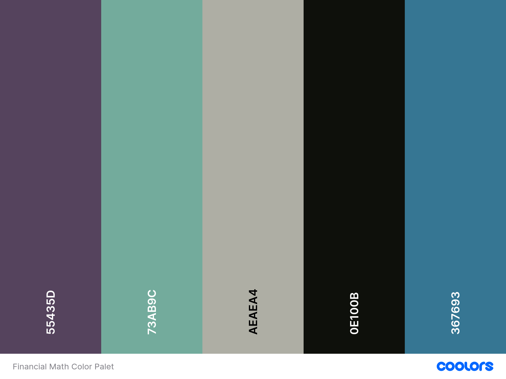

# Video Documents

## YouTube Videos

* Quick Start - Row Reducing a Matrix to Solve a System of Equations - Backgrounds: [PDF Version](./backgrounds/matrices-backgrounds.pdf) - [ODT Version](./backgrounds/matrices-backgrounds.odt)

## Calculator Videos

* Calculator Review: Tables - [script](./scripts/calculator_review_tables.md)
* Uploading Files to Blackboard - [script](./scripts/uploading_files.md)
* Computing Factorials - [script](./scrips/computing_factorials.md)

## Financial Mathematics

* [Thumbnail/Title Page Photo](https://www.pexels.com/photo/set-of-paper-money-with-images-and-symbols-4025877/)
* 
